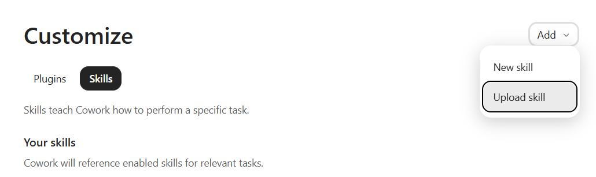

# eide-bailly-brand

A Microsoft Copilot Cowork skill that applies Eide Bailly's brand standards (approved colors, fonts,
logo files, and voice) to any Word, PowerPoint, or PDF deliverable. It takes about two minutes to
install and needs no admin rights or special software.

## Install

1. Download this repo as a zip (Code → Download ZIP on GitHub), or clone it.
2. In Copilot Cowork, go to **Customize → Skills**, click the arrow on the **Add** button, and choose **Upload skill**.

   

3. Upload the zip from step 1.
4. Ask Copilot to list your skills — you should see `eide-bailly-brand` in the results. To see it
   in action, ask Copilot to create an on-brand Eide Bailly one-pager and check that it uses our
   navy-and-blue colors and drops in the logo.

## What's in this repo

- `SKILL.md` — the skill's instructions (colors, fonts, logo rules, voice, legal entity name)
- `references/brand-guidelines-full.md` — the detailed reference (full palette, layout, voice, boilerplate)
- `assets/` — the four approved logo PNGs (primary/secondary, Black Blue/Stone White colorways)

## Updates

This repo is maintained by [Daniel Daou](mailto:ddaou@eidebailly.com). Pull the latest whenever there's a new version.
